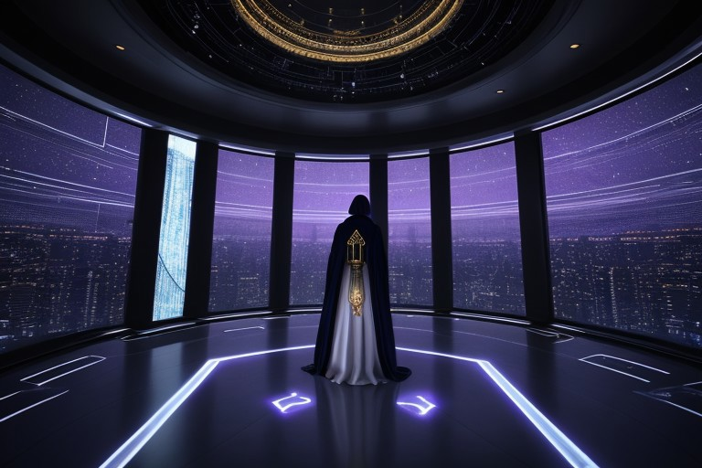

# Silent Sectors Stir: Corven Ash Brokers Delayed Truce Amid Rising Tensions

**Event Summary:**  
Corven Ash, a High Priestess of Tyrian Pact, brokered a fragile truce after weeks of silence.  
**Outcome:** Agreement delayed.

---

**📡 Social Dispatch – Excerpt for Galactic Public Network**

After weeks of cryptic silence and closed comms, High Priestess Corven Ash of the Tyrian Pact emerged from seclusion today to announce the tentative terms of a long-sought truce between warring Rim factions.

The announcement — broadcast in a haunting monochromatic feed from the Vaulted Temple of Veyla — marks the first sign of movement in a conflict that has paralysed diplomatic channels for nearly a month. Ash, whose enigmatic influence within the Pact blends spiritual authority with strategic command, claimed the “path to resonance” had been reopened after extensive communion rituals and backchannel negotiations.

Yet not all is calm. Observers report that several key factions have withheld endorsement, and no fleets have been stood down. One senior envoy described the truce as “a political mirage — meaningful only if no one blinks.”

As stars flicker quietly across the disputed sectors, all eyes now turn to the next 48 hours.

---

**🎨 DreamShaper Prompt**  
*A cloaked high priestess standing on a glass observation deck inside a vast temple spacecraft, starlight streaming in behind her. She raises one hand as if delivering a solemn broadcast. The room is lined with robed acolytes and flickering holograms of ancient scripts. Mood: spiritual, tense, sci-fi gothic. Tyrian Pact aesthetics — sharp angles, deep blue and violet tones, faint gold symbols. Cinematic lighting.*

---

