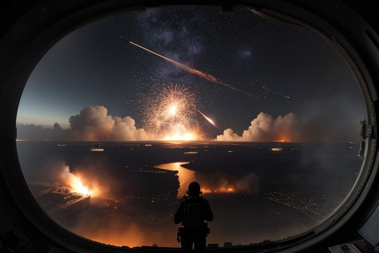

# 🚨 Kepler System Engagement Ends in Stalemate  
*Aurea Syle leads Tyrian Pact forces in a last-ditch stand*

---

## 🧾 Event Input  
**Type:** military  
**Main Actor:** Aurea Syle  
**Faction:** Tyrian Pact  
**Location:** Kepler System  
**Magnitude:** major  
**Outcome:** stalemate  

---

## 📝 Narrative Output  

> As the stars blazed above, Aurea Syle, a Warlord of Tyrian Pact, led a last-ditch defence against overwhelming forces.  
> Outcome: stalemate.

---

## ✍️ Elaboration (LLM-Enhanced)

### URGENT: Massive Fleet Engagement Erupts in Kepler System

**LIVE FROM THE FRONT** — What began as a routine patrol has exploded into the largest space battle in months as Admiral Thorne Malen's Tyrian Pact fleet clashed with unidentified enemy forces in the contested Kepler System just hours ago.

Our embedded correspondent aboard the TPS *Vengeance* reports that Malen's 7th Battle Group was conducting standard reconnaissance when long-range sensors detected a massive enemy formation emerging from hyperspace near the system's outer planets. The engagement began immediately as both fleets moved to secure the vital shipping lanes.

Preliminary reports indicate heavy casualties on both sides, with at least three Tyrian destroyers confirmed lost and multiple enemy vessels observed breaking apart under concentrated fire. The battle has spread across a debris field spanning thousands of kilometers, with fighter squadrons weaving between the hulks of disabled capital ships.

> “The whole horizon is on fire,” reports Lieutenant Commander Sarah Chen from the *Vengeance*'s bridge. “I've never seen anything like this scale of destruction.”

Warlord Aurea Syle, commanding from the dreadnought *Indomitus*, has committed her entire reserve squadron to the fight, signalling the immense strategic importance of holding the Kepler System. The enemy fleet's identity remains unknown, though their advanced shielding technology and coordinated tactics suggest a major power rather than independent raiders.

The battle continues as of this report, with both fleets locked in brutal close-quarters combat around Kepler-4's moon.

---

## 🎨 Image

---

## 🔮 Notes  
- Showcases high-stakes military storytelling  
- Uses faction lore, in-universe quotes, and visual war reporting  
- Future hook: identity of the attackers, tactical fallout, civilian evacuation  

---
